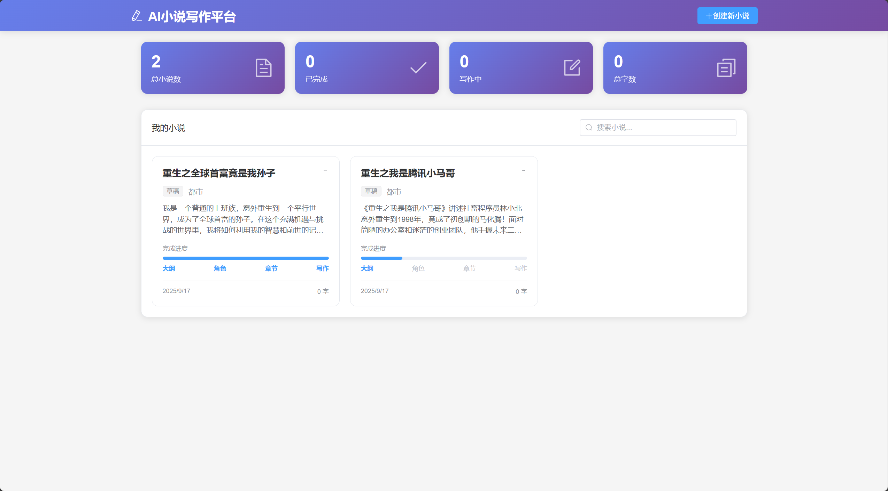
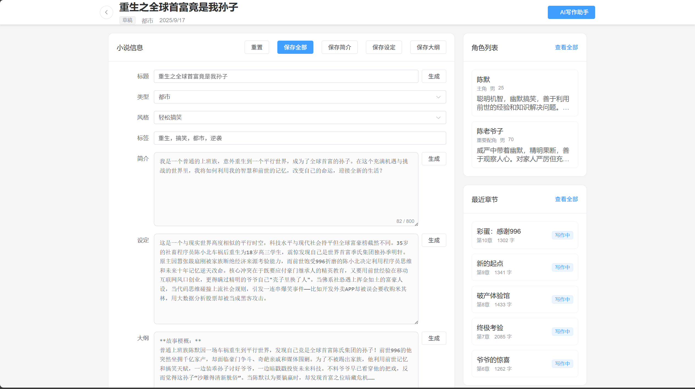
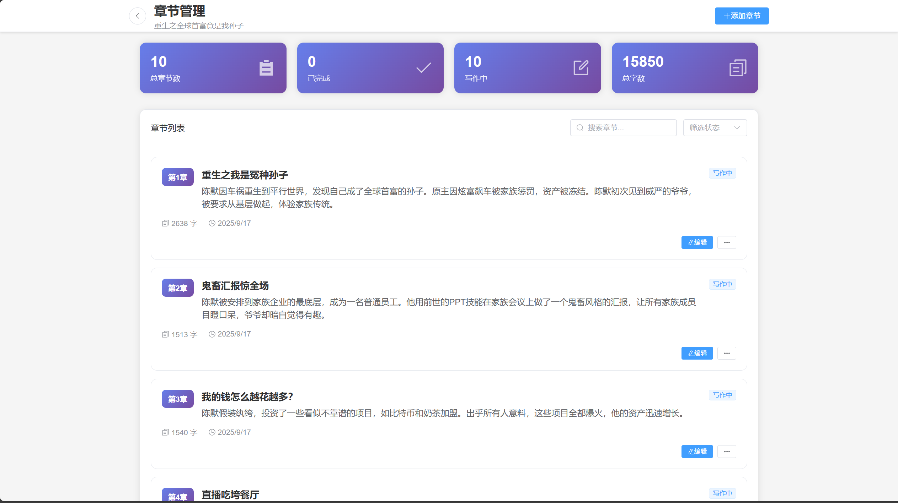
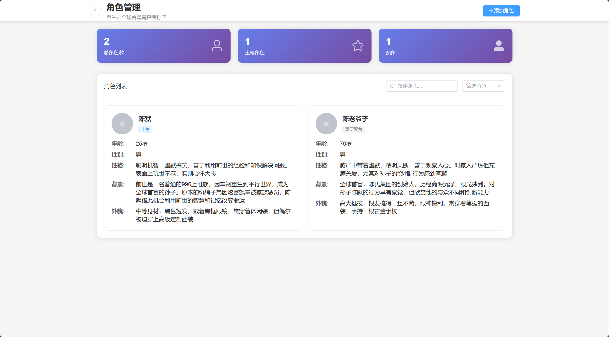

# NovelAgent - AI小说创作系统

一个基于Spring AI框架的智能小说创作平台，支持流式生成小说大纲、角色设定、章节内容等功能。用于学习SpringAI

## 🚀 项目特性

- **AI驱动创作**: 集成Spring AI框架，支持多种AI模型（OpenAI、Ollama等）
- **流式生成**: 支持Server-Sent Events (SSE) 实时流式生成内容
- **完整小说管理**: 包含小说详情、角色设定、章节管理等完整功能
- **数据库持久化**: 使用MySQL数据库存储小说数据
- **RESTful API**: 提供完整的REST API接口
- **现代化架构**: 基于Spring Boot 3.5.5和Java 24构建

## 🏗️ 技术栈

### 后端技术
- **Spring Boot 3.5.5** - 主框架
- **Spring AI 1.0.0-SNAPSHOT** - AI集成框架
- **Spring Data JPA** - 数据访问层
- **MySQL 8.0** - 数据库
- **Druid** - 数据库连接池
- **Lombok** - 代码简化
- **FastJSON2** - JSON处理

### AI模型支持
- **OpenAI API** - 支持GPT系列模型
- **Ollama** - 支持本地部署的开源模型
- **DeepSeek-V3** - 深度求索模型


## 🎯 核心功能

### 1. 小说管理
- 创建和保存小说基本信息
- 管理小说详情（标题、风格、类型、背景设定等）
- 查询小说详情

### 2. AI创作功能
- **大纲生成**: 根据小说设定自动生成详细大纲
- **角色设定**: 智能生成主要角色信息
- **章节规划**: 自动生成章节大纲
- **内容创作**: 流式生成具体章节内容

### 3. 流式输出
- 支持Server-Sent Events (SSE) 实时流式输出
- 提供良好的用户体验，实时查看生成进度

## 🛠️ 安装和配置

### 环境要求
- Java 24+
- Maven 3.6+
- MySQL 8.0+

### 1. 克隆项目
```bash
git clone <repository-url>
cd SpringAI
```

### 2. 配置数据库
创建MySQL数据库并修改 `application.properties` 配置：

```properties
spring.datasource.url=jdbc:mysql://localhost:3306/novel
spring.datasource.username=your_username
spring.datasource.password=your_password
```

### 3. 配置AI模型
在 `application.properties` 中配置AI模型：

```properties
# OpenAI配置
spring.ai.openai.base-url=https://api.openai.com
spring.ai.openai.api-key=your_api_key
spring.ai.openai.chat.options.model=gpt-4

# 或者使用Ollama本地模型
spring.ai.ollama.base-url=http://localhost:11434
spring.ai.ollama.chat.model=llama2
```

### 4. 运行项目
```bash
mvn spring-boot:run
```

## 🖼️ 项目截图

以下是一些项目界面的截图，展示了系统的实际运行效果：

### 小说创建界面


### 小说详情与大纲生成界面


### 角色管理界面


### 章节内容生成界面


## 📖 示例小说

查看AI生成的小说示例：[重生之我是冤种孙子](重生之我是冤种孙子.md)

## 🔧 开发说明

### 添加新的AI模型
1. 在 `pom.xml` 中添加对应的Spring AI依赖
2. 在 `application.properties` 中配置模型参数
3. 在 `NovelAgentServiceImpl` 中注入对应的ChatModel

### 自定义提示词
在 `PromptConstant.java` 中修改或添加新的提示词模板。

### 扩展功能
- 可以添加更多的小说类型支持
- 实现用户系统和个人作品管理
- 添加小说评价和分享功能
- 支持多种输出格式（PDF、EPUB等）

## 📝 注意事项

1. **API密钥安全**: 请妥善保管AI模型的API密钥，不要提交到版本控制系统
2. **数据库配置**: 确保MySQL服务正常运行，数据库连接配置正确
3. **模型选择**: 根据需求选择合适的AI模型，不同模型的生成质量和速度有差异
4. **流式输出**: 流式接口返回的是SSE格式，前端需要相应处理

## 🤝 贡献指南

欢迎提交Issue和Pull Request来改进这个项目！

## 📄 许可证

本项目采用MIT许可证，详情请查看LICENSE文件。

## 📞 联系方式

如有问题或建议，请通过以下方式联系：
- 提交Issue
- 发送邮件至：[your-email@example.com]

---

**注意**: 此README通过AI生成，可能存在错误或不准确的地方，仅供参考。